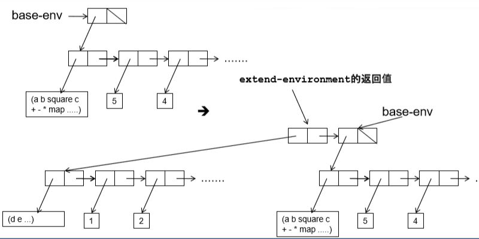
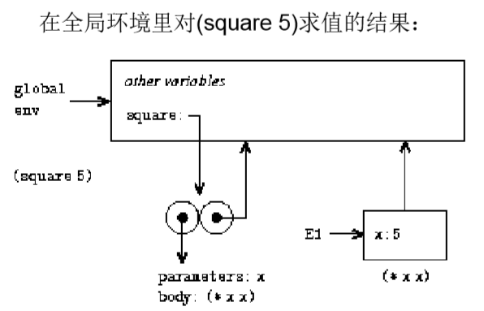

# Scheme解释器

* 元循环：用一种语言实现自身的求值器
* 用Scheme实现Scheme求值器，以Scheme程序作为输入，输出为运行结果
* 求值环境模型在[gw_sicp_1](https://github.com/Lizhmq/SICP/blob/master/Texts/gw_sicp_03_01.pdf)有详细描述


## my-eval函数

* 基本表达式

		自求值表达式（数、字符串）：直接返回

		变量：从环境env中读出当前的值

* 特殊形式

		单引号表达式（如'(1 2 3)）：返回单引号后面的表达式

		变量赋值或定义：递归调用my-eval计算所赋的值，然后在环境中修改变量的值或增加约束
		
		if表达式：根据条件部分的求值结果求值相应子表达式
		
		lambda表达式：建立过程对象，在环境中做相应修改
		
		begin表达式：按顺序求值各个表达式
		
		cond表达式：变换为嵌套的if表达式
		
		let表达式：转换为lambda表达式，参数通过my-eval递归求值得到，然后运用my-apply
		
		增加了and,or的实现，需要注意的是，scheme中的and、or不仅是返回true/false，当and表达式为真时，返回最后一个子表达式的值，or表达式返回第一个不是false的值

* 组合式（过程）

		递归地求值运算符部分和运算对象部分，将得到的过程和参数应用于my-apply


## 表达式类型和成分切割

通过表达式exp的首项确定类型

```scheme
(define (tagged-list? exp tag)
  (if (pair? exp)
      (eq? (car exp) tag)
      false))
```

以if表达式为例：

```scheme
(define (if? exp)
  (tagged-list? exp 'if))
```


成分切割大部分比较使用简单的car、cdr组合就可以完成，下面提几个特殊的情况：

* if表达式分为predicate、consequent和alternative三部分，需要判断alternative部分是否存在
* cond增加特殊形式:

```scheme
cond ([test] => [recipient])
```

如果[test]求出的值是真，就对[recipient]求值，[recipient] 求出的值必须是一个单一参数的过程。将这一过程应用于[test]的值，并将过程返回值作为这个cond表达式的值。

cond-actions部分不存在时，以cond-predicate部分为返回值

* define表达式有两种形式：

```scheme
(define <var> <value>)
(define (<var> paras...) (body)) => (define <var> (lambda (paras...) (body)))
```

根据(cadr exp)是否为symbol可判断是哪种形式，然后做对应处理


## 对应类型的求值

* eval-and、eval-or、eval-if、eval-sequence较简单
* lambda表达式my-eval后得到环境中约束的过程
* eval-let转换为lambda表达式后，my-eval得到过程再用my-apply求值
* eval-assignment、eval-definition和lookup-variable-value的对应与环境框架有关


## 环境

环境env看作一个序对，car部分为当前环境--frame框架，cdr部分为外层环境

frame也是一个序对，car部分是约束的变量组成的list，cdr部分是对应的值的list



求值过程时，建立新的内层环境并在其中求值




# 正则序解释器

* 一般来说，Scheme采用的时应用序求值，即在调用过程之前便对所有参数求值
* 惰性求值：将参数求值推迟到实际需要时

```scheme
;在这个例子中，正则序可以运行，而应用序报错
(define (try a b)
  (if (= a 0) 1 b))
(try 0 (/ 1 0))
```

* 惰性求值的实现
  * 为参数建立一个称为槽(thunk)的特殊对象，当需要使用时，从槽中取出参数（称为强迫）
  * 需要强迫槽的三种情况：
    * 某个基本过程要使用槽的值
    * 槽的值被作为条件表达式的谓词
    * 某个要求值的表达式以槽为运算符
  * 对应这三种情况，分别修改对应的过程（如eval-if、my-apply等）
  * 可以实现记忆性的槽，一定程度上提高效率（需要考虑可能对语义造成的影响）
* 用过程定义cons、car、cdr，由于参数的惰性求值，列表便自然地成为流
  * 需要注意的是输入中形如'(a b c)的列表要人为地转化为定义的cons对，否则无法运用car、cdr方法


# 可指定参数是否严格的解释器

* 上面对解释器的修改有一个严重的问题--不是前向兼容的
* 因此，可以实现能指定参数是否严格的解释器从而在兼容的前提下同时实现惰性求值
* 参数的严格性：
  * 如果过程要求在执行过程体之前对某个参数求值，则称该过程对该参数是严格的，否则是不严格的
  * 纯应用序的语言过程对所有参数都是严格的
  * 纯正则序的语言，复合过程对所有参数都不严格，基本过程可以是严格的，也可以是不严格的
  * 允许某些过程的某些参数不严格有时很方便，例如用cons构造数据结构时可以在结构尚未完全确定时就使用它（例如流的例子）
* 主要修改my-apply中的参数解析


# 分析和执行分离的解释器

* 在前面实现的Scheme求值器中，以procedure形式实现的过程中包含源代码：

  ```scheme
  (procedure (n)
             ((if (= n 1)
                  1
                  (* (factorial (- n 1) n)))
              glb-env)
  ```

  每次递归调用factorial，都需要在环境中寻找对象的约束，然后对函数体源代码分析和求值，十分浪费。

* 实现语法分析与求值分离，先对表达式analyze得到一个参数为env的过程，然后eval求值。
